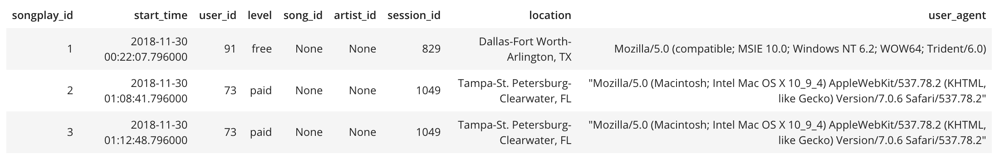
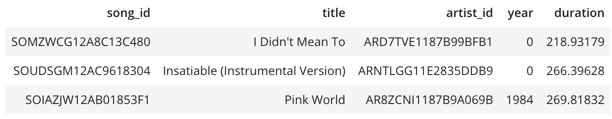
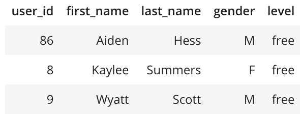
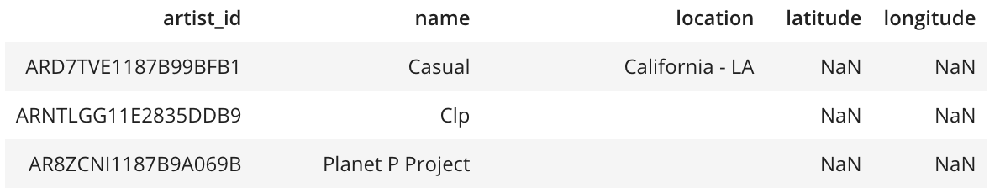
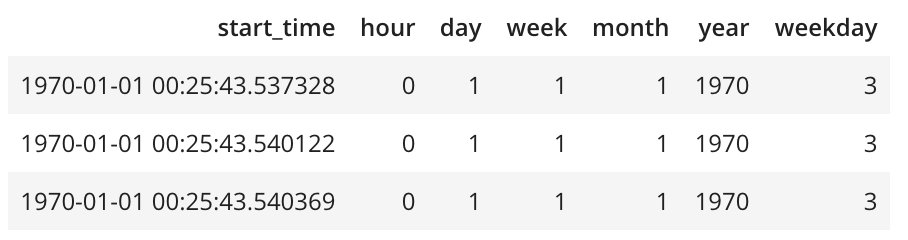

# Data Modeling with Postgres

## Overview

To complete the project, you will need to define fact and dimension tables for a star schema for a particular analytic focus, and write an ETL pipeline that transfers data from files in two local directories into these tables in Postgres using Python and SQL.


### Song Dataset
The first dataset is a subset of real data from the Million Song Dataset. Each file is in JSON format and contains metadata about a song and the artist of that song. The files are partitioned by the first three letters of each song's track ID. For example, here are filepaths to two files in this dataset.

```
song_data/A/B/C/TRABCEI128F424C983.json
song_data/A/A/B/TRAABJL12903CDCF1A.json
```

A sample data from a single song file looks like:

```json
{"num_songs": 1, "artist_id": "ARJIE2Y1187B994AB7", "artist_latitude": null, "artist_longitude": null, "artist_location": "", "artist_name": "Line Renaud", "song_id": "SOUPIRU12A6D4FA1E1", "title": "Der Kleine Dompfaff", "duration": 152.92036, "year": 0}
```
### Code files in the folder
`sql_queries.py` is used to create, drop, or insert data to each table.
`create_db.py` is used to create database if not yey exists.
`create_tables.py` calls `sql_queries.py` to create your database and tables.
`etl.py` is meant to develop ETL processes for each table, which specifically read in json files and insert data to the correct sql tables.
`test.ipynb` is used to confirm the creation of your tables with the correct columns.


### How to run the codes in this repo

create db
```
python create_db.py
```

create tables
```
python create_tables.py
```

run etl to insert data into tables
```
python etl.py
```

Finally, use test.ipynb to check the results in each tables.

### examples of each table after etl process

`%sql SELECT * FROM songplay_table;`


`%sql SELECT * FROM song_table;`


`%sql SELECT * FROM user_table;`


`%sql SELECT * FROM artist_table;`


`%sql SELECT * FROM time_table;`

